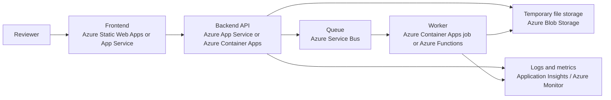

# Alcohol Label Verification Prototype

## Executive Summary

This repository contains a standalone prototype for reviewing alcohol label images against TTB-style checklist requirements. The goal of the prototype is not to replace compliance judgment. It is to reduce time spent on routine checks, make likely issues easier to spot, and give reviewers a faster starting point for human decision-making.

The current implementation focuses on a few practical outcomes:

- make the workflow simple enough for non-technical reviewers to use
- keep the system conservative so uncertain cases are surfaced for human review instead of being over-automated
- use a local-first OCR approach so the prototype can still operate in restricted network environments
- structure the application so it can move to Azure later without changing the core product shape

In short, this prototype demonstrates that we can turn uploaded label artwork into a structured checklist review with clear reviewer-facing explanations, while keeping the architecture lightweight and easy to evolve.

## What The Prototype Does

The product supports two user workflows:

- single-label review through `POST /review`
- batch review through `POST /batch` and `GET /batch/{job_id}`

As built today, the product reviews label artwork only. It does not yet accept separate application data and does not perform a submitted-value-versus-extracted-value comparison workflow.

For each uploaded label, the system:

1. reads the label text through OCR or text passthrough for deterministic test inputs
2. infers the most likely beverage type
3. extracts key evidence such as designation, alcohol content, net contents, producer/importer text, and government warning text
4. selects the matching checklist for wine, distilled spirits, or malt beverage
5. evaluates each checklist item as either `pass` or `review`
6. returns clear explanations and human-review reasons rather than opaque scores

The frontend is intentionally simple. Users choose either a single review or batch review flow, upload files, and receive a structured result view showing passed checks, review items, and the detected beverage type.

## Design Choices And Why They Were Made

### 1. Review-first, not auto-approval

The most important product choice in the current implementation is that the system produces checklist-style `pass` or `review` outcomes rather than automated approvals or rejections.

Why this matters:

- compliance decisions are high-trust and often nuanced
- OCR can be imperfect, especially with skew, glare, or stylized labels
- a conservative system is easier to trust than one that appears more certain than it really is

This is reflected directly in the backend response model and the UI. If the system cannot confirm a rule with confidence, it explicitly tells the reviewer why human attention is needed.

This is narrower than the original project brief, which called for explicit submitted-value-versus-label comparison statuses such as match, mismatch, missing, and uncertain. The README is describing the product as it currently exists.

### 2. Local-first OCR with graceful fallback

The OCR layer is abstracted behind a provider interface in [backend/app/services/ocr.py](/Users/tguan/Documents/Projects/treasury-take-home/backend/app/services/ocr.py). Today it supports:

- a text passthrough provider for deterministic test inputs and non-image fallback cases
- an optional Tesseract-based provider for real image OCR

Why this was chosen:

- it reduces dependence on external services for the MVP
- it fits restricted-network or government-hosted environments better than a cloud-only OCR dependency
- it keeps the door open to replace or supplement Tesseract later with Azure-native OCR services if accuracy or operability demands it

The OCR flow also includes bounded preprocessing such as grayscale conversion, denoising, thresholding, resizing, and light deskewing. That choice improves OCR quality without introducing a large ML pipeline or heavy model-serving requirement.

### 3. Typed contracts between frontend and backend

The backend uses Pydantic response models in [backend/app/models/schemas.py](/Users/tguan/Documents/Projects/treasury-take-home/backend/app/models/schemas.py), and the frontend mirrors those shapes with TypeScript interfaces in [frontend/src/lib/types/api.ts](/Users/tguan/Documents/Projects/treasury-take-home/frontend/src/lib/types/api.ts).

Why this matters:

- it keeps the user interface aligned with API behavior
- it reduces integration ambiguity
- it makes the prototype easier to extend safely

This was a deliberate choice to make the prototype feel production-shaped even though the scope is still small.

### 4. Rules transcribed into code instead of dynamically parsed from source PDFs

The checklists are represented as structured runtime rules rather than being parsed from PDFs on every request.

Why this was chosen:

- it keeps execution fast and predictable
- it avoids runtime complexity from document parsing
- it makes rule evaluation easier to test and reason about

For a prototype, maintainability and clarity were more important than building a dynamic rules ingestion pipeline.

### 5. Manager-friendly, low-friction UI

The SvelteKit frontend intentionally minimizes workflow complexity:

- one route for single-label review
- one route for batch submission
- one route for viewing batch status

The interface does not expect users to prepare JSON, map fields manually, or understand OCR internals. That design choice directly supports the target audience of mixed technical comfort levels.

## Implementation Details

## Architecture

The deployed application shape is a lightweight web frontend plus a FastAPI backend.
On Railway, the frontend is the only public service. The backend stays private and is
reached only through Railway private networking.

```text
Browser
        |
        v
Public SvelteKit frontend
  - Railway managed domain
  - same-origin /api/* routes
        |
        v
Private FastAPI API layer
  - Railway private network only
  - no public domain
        |
        v
Review services
  - OCR
  - field extraction
  - checklist evaluation
        |
        v
Structured review response
```

The current repository is organized as follows:

- `frontend/src/`: SvelteKit UI
- `backend/app/api/`: FastAPI routes
- `backend/app/services/`: OCR, extraction, comparison, and review orchestration
- `backend/app/models/`: typed API schemas
- `backend/tests/`: backend tests and OCR fixtures

## Backend behavior

The backend entry point is [backend/app/main.py](/Users/tguan/Documents/Projects/treasury-take-home/backend/app/main.py). It exposes three main API paths in [backend/app/api/routes.py](/Users/tguan/Documents/Projects/treasury-take-home/backend/app/api/routes.py):

- `GET /health`
- `POST /review`
- `POST /batch`
- `GET /batch/{job_id}`

The core orchestration happens in [backend/app/services/review.py](/Users/tguan/Documents/Projects/treasury-take-home/backend/app/services/review.py):

- build OCR input
- extract text through the selected provider
- infer beverage type
- extract structured evidence from OCR text
- evaluate the matching checklist
- aggregate reviewer-facing explanations and reasons

The current backend does not ingest a separate application-data payload. It reviews the label image on its own and returns a structured checklist result derived from OCR and rule evaluation.

Important implementation characteristics:

- batch jobs are currently stored in memory
- batch items are processed independently so one failure does not block the rest
- the system prefers explicit review reasons over hidden heuristics
- some checklist items intentionally stay manual when OCR alone is not reliable enough

One concrete example is the distilled-spirits same-field-of-vision requirement. The code explicitly marks that rule for human review because layout verification is not dependable from OCR text alone. That is a deliberate trust decision, not an unfinished accident.

## Extraction and comparison logic

The extraction layer in [backend/app/services/extraction.py](/Users/tguan/Documents/Projects/treasury-take-home/backend/app/services/extraction.py) uses conservative pattern matching to identify:

- beverage family
- brand name
- designation
- alcohol content
- net contents
- producer/importer text
- country of origin
- appellation of origin
- several conditional disclosure phrases

The comparison utilities in [backend/app/services/comparison.py](/Users/tguan/Documents/Projects/treasury-take-home/backend/app/services/comparison.py) normalize ordinary text loosely while keeping the government warning exact.

This comparison layer is used inside the label-review pipeline itself. It is not yet a full label-versus-application reconciliation layer.

That split was intentional:

- ordinary label fields often vary in punctuation, capitalization, or formatting
- the government warning is a legally sensitive field where wording and capitalization matter more

This is a good example of the broader prototype philosophy: tolerate harmless variation where reasonable, but stay strict where trust and compliance risk are higher.

## Frontend behavior

The frontend routes are intentionally simple:

- home: [frontend/src/routes/+page.svelte](/Users/tguan/Documents/Projects/treasury-take-home/frontend/src/routes/+page.svelte)
- single review: [frontend/src/routes/review/+page.svelte](/Users/tguan/Documents/Projects/treasury-take-home/frontend/src/routes/review/+page.svelte)
- batch submission: [frontend/src/routes/batch/+page.svelte](/Users/tguan/Documents/Projects/treasury-take-home/frontend/src/routes/batch/+page.svelte)
- batch status: [frontend/src/routes/batch/[jobId]/+page.svelte](/Users/tguan/Documents/Projects/treasury-take-home/frontend/src/routes/batch/[jobId]/+page.svelte)

The frontend API client in [frontend/src/lib/api/client.ts](/Users/tguan/Documents/Projects/treasury-take-home/frontend/src/lib/api/client.ts) validates that responses contain the expected top-level structure before rendering them. This is a small but useful defensive choice that helps prevent silent UI failures if the API contract drifts.

In Railway production, the browser never talks to FastAPI directly. The browser calls frontend-local routes such as `/api/review`, and SvelteKit server routes proxy those requests to the private backend using the server-only `BACKEND_PRIVATE_BASE_URL` environment variable. That proxy layer lives under [frontend/src/routes/api/](/Users/tguan/Documents/Projects/treasury-take-home/frontend/src/routes/api/).

The results UI is optimized for scanning:

- green for passed checks
- yellow for human-review items
- plain-language explanations
- grouped checklist sections
- summary counts at the top

The interface is less focused on technical transparency for developers and more focused on operational clarity for reviewers and managers evaluating whether the flow is understandable.

## Current Prototype Limitations

This prototype is intentionally narrow, and there are a few important limitations to call out plainly:

- the current implementation does not accept or compare separate application data
- result statuses are checklist-oriented `pass` or `review`, not the fuller match/mismatch/missing taxonomy from the original brief
- batch job state is ephemeral and stored in process memory
- batch processing is initiated synchronously inside the API process today rather than through a durable queue
- OCR accuracy depends on optional local dependencies and the presence of the `tesseract` executable
- several layout-sensitive or highly contextual checklist rules still require human review by design
- batch status is not durable across backend restarts
- Railway deployment currently assumes the backend private hostname `backend.railway.internal`

These are reasonable prototype tradeoffs. They keep the implementation simple while still showing the product flow, review model, and architectural direction.

## Railway Deployment

The repository now includes Railway configuration in [/.railway/railway.ts](/Users/tguan/Documents/Projects/treasury-take-home/.railway/railway.ts).

### Production shape

- `frontend` is deployed from `/frontend`
- `backend` is deployed from `/backend`
- only `frontend` gets a Railway-managed public domain
- `backend` stays private and is reached at `http://backend.railway.internal:8080`

### Why the backend is private

This deployment routes all browser traffic through the frontend server:

- the browser posts to same-origin frontend routes such as `/api/review`
- the frontend server proxies those requests to the private backend
- the backend is not exposed on the public internet

That gives a simpler production CORS posture and a smaller public attack surface.

### Backend service details

The backend is packaged as its own Python service root:

- [backend/pyproject.toml](/Users/tguan/Documents/Projects/treasury-take-home/backend/pyproject.toml)
- [backend/Dockerfile](/Users/tguan/Documents/Projects/treasury-take-home/backend/Dockerfile)

The backend Docker image installs:

- Python dependencies
- OCR Python extras
- the `tesseract-ocr` system package

The backend starts with:

```bash
uvicorn app.main:app --host 0.0.0.0 --port ${PORT}
```

### Frontend service details

The frontend uses `@sveltejs/adapter-node` so Railway can run it as a Node server.

Important production settings:

- `BACKEND_PRIVATE_BASE_URL=http://backend.railway.internal:8080`
- `BODY_SIZE_LIMIT=10M`

The body size limit matters because the SvelteKit Node adapter otherwise rejects larger label uploads before they ever reach FastAPI.

### Railway setup steps

1. Push the repo to GitHub `main`.
2. Create a Railway project from the GitHub repository.
3. Create a `backend` service with root directory `/backend`.
4. Let the backend build from [backend/Dockerfile](/Users/tguan/Documents/Projects/treasury-take-home/backend/Dockerfile).
5. Do not generate a public domain for the backend.
6. Create a `frontend` service with root directory `/frontend`.
7. Generate a Railway-managed public domain for the frontend service only.
8. Set `BACKEND_PRIVATE_BASE_URL=http://backend.railway.internal:8080` on the frontend service.
9. Set `BODY_SIZE_LIMIT=10M` on the frontend service.
10. Enable GitHub auto-deploy from branch `main` for both services if that feature is available in your Railway plan.

### Production verification checklist

- the frontend public domain loads
- `POST /api/review` succeeds through the frontend
- `POST /api/batch` succeeds through the frontend
- the backend has no public Railway domain
- `GET /health` succeeds inside the backend container
- `tesseract --version` succeeds inside the backend container

## Why This Approach Is A Good Prototype Shape

From a management perspective, this implementation is a good prototype shape because it balances speed of delivery with architectural discipline.

What it proves:

- reviewers can get meaningful structured output from label uploads
- the product can explain uncertainty instead of hiding it
- the frontend and backend contract is stable enough to evolve
- the OCR and checklist layers are separated cleanly enough to swap implementations later

What it avoids:

- over-investing in infrastructure before the workflow is validated
- over-promising automation accuracy
- coupling the MVP to a single hosted OCR vendor

## Azure Deployment Approach

## Recommended Azure target architecture

If this prototype moved into an Azure-hosted environment, the recommended shape would be:



## How deployment would work in practice

### Frontend

The SvelteKit frontend can be deployed in one of two practical ways:

- `Azure Static Web Apps` if we keep the frontend largely static and API-driven
- `Azure App Service` or `Azure Container Apps` if we want to host the frontend as part of a containerized web tier

For this prototype, Static Web Apps plus a separately hosted API would likely be the simplest operational model.

### Backend API

The FastAPI backend is already a good fit for:

- `Azure App Service` for a simpler managed web-hosting path
- `Azure Container Apps` if we want stronger container control, easier sidecar patterns, or closer alignment with a future worker model

If we keep Tesseract-based OCR, containerization is the safer choice because we can package the OCR binary and image-processing dependencies predictably. That makes `Azure Container Apps` the stronger long-term fit for the current implementation.

### Batch and heavy processing

The current code processes batch work in-process and stores results in memory. In Azure, that should change.

Recommended production-shaped evolution:

1. the API accepts uploads and stores files in temporary Blob Storage
2. the API writes a job message to Azure Service Bus
3. a worker pulls the message and runs OCR plus checklist evaluation
4. job results are written to a durable result store
5. the frontend polls a job-status endpoint or receives updates through a push mechanism later

This change would preserve the product behavior while removing the biggest scalability and reliability limitation of the current prototype.

### Storage

For prototype deployment, the storage needs are modest:

- `Azure Blob Storage` for uploaded images and temporary artifacts
- a small durable state store for batch job metadata and results

Reasonable durable-state options:

- Azure Table Storage for a simple low-complexity job store
- Azure Cosmos DB if richer querying or broader future scale is needed
- Azure SQL only if relational requirements emerge later

For this prototype, a simple document or key-value style store would be sufficient.

### Secrets and configuration

Environment-specific configuration should be provided through:

- Azure App Settings or Container Apps environment variables
- Azure Key Vault for secrets if external OCR or other services are added later

The current backend settings model in [backend/app/core/config.py](/Users/tguan/Documents/Projects/treasury-take-home/backend/app/core/config.py) is already small and environment-variable driven, which makes this transition straightforward.

### Monitoring and supportability

A manager should expect a deployable Azure version to include:

- health probes on the API
- centralized application logs
- request latency monitoring
- job success and failure metrics
- queue depth monitoring for batch workloads

The natural Azure fit is `Application Insights` plus `Azure Monitor`.

## Azure Risks And Decisions To Make

If the team chose to move beyond the prototype, the main Azure decisions would be:

### 1. Keep local OCR or move to Azure OCR

Option A: keep Tesseract in containers

- stronger control over data locality and fewer runtime external dependencies
- more responsibility for OCR packaging, scaling, and tuning

Option B: move to an Azure OCR service such as Azure AI Document Intelligence or Vision OCR

- likely easier operationally and potentially stronger extraction quality
- adds a managed-service dependency and changes the network/data flow model

Because the current backend uses a provider abstraction, this decision can be deferred until accuracy, security, and hosting constraints are clearer.

### 2. Durable batch status storage

The current in-memory job store is suitable only for local prototype use. Any Azure deployment intended for shared usage would need durable storage for job state.

### 3. Retention and compliance controls

If the system starts handling more realistic data volumes or more sensitive material, the deployment would need explicit decisions on:

- upload retention windows
- deletion policies
- access controls
- audit expectations

Those controls are intentionally light in the prototype because the current goal is workflow validation, not full production governance.

## Suggested Next Steps

If this prototype were being advanced for a more serious pilot, the highest-value next steps would be:

1. move batch processing from in-memory execution to a queue-backed worker model
2. add durable job-result storage
3. make the backend private hostname configurable if Railway service naming changes
4. add Azure deployment manifests and basic infrastructure-as-code
5. expand rule coverage and real-label test fixtures
6. evaluate whether Azure OCR meaningfully improves accuracy or supportability

## Stack

- Frontend: SvelteKit + TypeScript
- Backend: FastAPI + Python 3.11
- OCR approach: local-first provider abstraction with optional Tesseract support
- Testing: `pytest`, `vitest`, `@testing-library/svelte`

## Local Setup

## Backend

```bash
python3 -m venv .venv
. .venv/bin/activate
pip install -e './backend[dev]'
.venv/bin/uvicorn app.main:app --app-dir backend --reload
```

The `backend[dev]` extra now includes `pytesseract` and the image-processing libraries used by the OCR provider.

Install the `tesseract` executable separately for your platform before testing OCR on image uploads:

macOS:

```bash
brew install tesseract
```

Ubuntu or Debian:

```bash
sudo apt-get update
sudo apt-get install --yes tesseract-ocr
```

Fedora:

```bash
sudo dnf install --assumeyes tesseract
```

Windows:

1. Install [Tesseract OCR for Windows](https://github.com/UB-Mannheim/tesseract/wiki).
2. Add the Tesseract install directory, commonly `C:\Program Files\Tesseract-OCR`, to your `PATH`.
3. Open a new terminal and run `tesseract --version` to confirm it is available.

If you only want the OCR-specific Python dependencies without the rest of the backend dev toolchain:

```bash
pip install -e './backend[ocr]'
```

Without the local `tesseract` executable, the backend still returns a structured review, but image files will be marked for human review with an OCR availability reason.

## Frontend

```bash
cd frontend
pnpm install
pnpm dev
```

Set `BACKEND_PRIVATE_BASE_URL` only if the frontend server should proxy to a backend other than `http://localhost:8000`.

For Railway, the browser talks only to the frontend service. The frontend server proxies API traffic to the backend over private networking.

If you want local uploads that are closer to production size, you can also run the frontend with a larger body limit:

```bash
cd frontend
BODY_SIZE_LIMIT=10M pnpm dev
```

## Verification

Backend:

```bash
pytest
```

Frontend:

```bash
cd frontend
pnpm test
pnpm check
```
