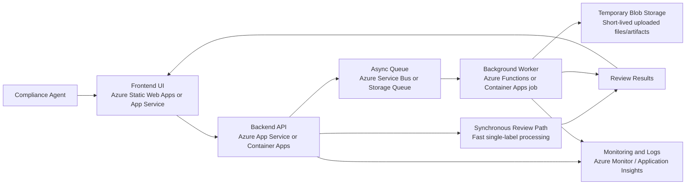

# Requirements for AI-Powered Alcohol Label Verification Prototype

## Purpose

Build a standalone prototype that helps TTB compliance agents review alcohol label applications faster by automatically comparing application data against label artwork and surfacing likely mismatches for human review.

The product should reduce time spent on routine verification while preserving human judgment for edge cases and nuanced compliance decisions.

## Primary Users

- Compliance agents with mixed technical comfort levels
- Compliance supervisors evaluating throughput improvements
- Internal stakeholders assessing whether the concept is viable for future procurement or integration

## Product Goals

- Speed up routine label-review work
- Reduce repetitive manual field matching
- Preserve human oversight for ambiguous cases
- Be simple enough for low-tech users to operate confidently
- Demonstrate value as a standalone proof of concept without requiring COLA integration

## Core Functional Requirements

### 1. Single-label review workflow

The application must allow a user to:

- Upload or provide a label image
- Enter or upload the corresponding application data
- Run an automated review
- View extracted label values alongside application values
- See which fields match, mismatch, or could not be confidently read

### 2. Field comparison

The system must compare common required label fields against application data, including:

- Brand name
- Class/type designation
- Alcohol content / ABV
- Net contents
- Name and address of bottler/producer when provided
- Country of origin for imports when provided
- Government Health Warning Statement

Implementation guidance for the prototype:

- Ordinary fields should use tolerant comparison with normalization and fuzzy matching where appropriate
- Warning-statement validation should remain strict and exact
- Comparison results should include submitted value, extracted value, normalized forms, status, and a short explanation so reviewers can understand why a field was flagged

### 3. Match-status output

For each checked field, the system must clearly indicate:

- Match
- Mismatch
- Missing from label
- Missing from application
- Uncertain / needs human review

### 4. Review-first design

The application must assist agents rather than auto-approve labels.

- Final judgment remains with the user
- The system should surface issues and confidence, not replace compliance judgment

### 5. Exact government warning validation

The system must validate the Government Health Warning Statement more strictly than other fields.

- The warning text should be checked for exact wording
- The `GOVERNMENT WARNING:` prefix should be checked for capitalization
- The result should clearly flag non-exact variants for review or rejection

### 6. Flexible text comparison for ordinary fields

For standard fields like brand name, the system should tolerate minor formatting differences when reasonable, such as:

- Case differences
- Apostrophe style differences
- Minor punctuation differences

The UI should still make the normalized comparison visible so agents can decide whether the variation is acceptable.

### 7. Batch processing

The prototype should support batch review for multiple label applications in one session.

- Users should be able to upload multiple labels
- Results should be viewable as a queue or table
- Users should be able to open each item for detailed review

## Usability Requirements

### 8. Very simple interface

The interface must be easy for low-tech users to understand.

- Primary actions should be obvious
- Minimal navigation should be required
- Results should be easy to scan
- Users should not need training to complete a basic review

### 9. Fast feedback

The system should return results quickly enough to fit the current review workflow.

- Target response time: about 5 seconds per label
- Performance materially slower than 5 seconds will reduce adoption

### 10. Clear error handling

If the system cannot reliably process an image or field, it should say so clearly and suggest the next step, such as:

- Review manually
- Upload a clearer image
- Re-run extraction

## Prototype Scope Requirements

### 11. Standalone deployment

The prototype should be a standalone web application.

- No direct COLA integration is required
- No dependency on internal TTB systems is required for the prototype

### 12. Safe handling of prototype data

The prototype should avoid unnecessary retention of uploaded data.

- Do not assume long-term storage is required
- Keep the design simple and appropriate for non-sensitive prototype use
- Prefer stateless processing where practical
- If temporary storage is needed for uploads or batch jobs, it should be short-lived and minimized

### 13. Limited external dependency risk

The implementation should account for restricted government-network environments.

- Avoid designs that depend heavily on outbound access to blocked third-party services
- Favor local or self-contained processing where practical
- If external APIs are used, document the network dependency and fallback behavior

### 14. Azure-compatible future deployment path

The prototype should be designed so it can be deployed to Azure without major architectural changes.

- The application should use a cloud-friendly web architecture
- Components should be containerizable or otherwise easily hosted on Azure-managed services
- Storage and processing choices should have clear Azure equivalents
- Deployment assumptions should align with a future government-hosted Azure environment

### 15. Prototype architecture must scale to future demand

The solution should be structured so the prototype can evolve from low-volume testing to larger review workloads.

- It should support concurrent users without redesigning the whole system
- It should support bursty workloads such as batch uploads from large importers
- Long-running or batch work should be separable from the interactive web request path
- The architecture should allow independent scaling of UI, API, and document-processing workloads

### 16. Background processing for batch and heavy workloads

The architecture should include an asynchronous processing path for work that may exceed the interactive response target.

- Single-label review may run inline if it stays within the performance target
- Batch jobs should be queued and processed asynchronously
- Users should be able to see processing status for batch submissions
- Failures in one item should not block the rest of the batch

## Quality Requirements

### 17. Accuracy over automation theater

The prototype should prioritize trustworthy outputs over flashy automation.

- It is better to mark a field as uncertain than confidently wrong
- Ambiguous cases should be escalated to human review

### 18. Support imperfect inputs

The system should work with typical label images and, if possible, tolerate moderate quality issues such as:

- Slight skew
- Non-ideal lighting
- Mild glare

This is a desirable capability for the prototype, but not at the cost of core workflow reliability.

### 19. Observable and supportable deployment

The system should be designed so future operators can monitor health and diagnose failures.

- Application errors should be logged centrally
- Processing status should be traceable across upload, extraction, comparison, and review steps
- Basic performance metrics should be available for response times, queue depth, and failed jobs

## Proposed Deployment Architecture

The prototype should use a lightweight, stateless architecture that can be deployed to Azure and scaled without major redesign. A simple frontend should handle uploads, review results, and batch status, while a backend API performs field comparison and orchestrates processing. For fast single-label reviews, the API may process requests synchronously when it can stay within the target response time of about 5 seconds. For batch submissions or heavier OCR workloads, processing should move to a background worker behind a queue so spikes in volume do not slow down the interactive user experience. If temporary file handling is needed, uploaded images may be stored briefly in Azure Blob Storage with short retention, but the system should not rely on a persistent database for prototype operation. This architecture maps cleanly to Azure services such as App Service or Container Apps for the API, Functions or worker containers for background jobs, Service Bus or Storage Queue for asynchronous processing, Blob Storage for short-lived artifacts, and Azure Monitor/Application Insights for observability. This keeps the prototype small and operationally simple while preserving a clear path to future scaling in the agency's Azure environment.

### MVP Technology Choices

The following technology choices are recommended for the prototype implementation:

- Frontend: SvelteKit
- Backend API: FastAPI, Pydantic, Uvicorn
- File upload handling: `python-multipart`
- OCR preprocessing: `opencv-python-headless`, `Pillow`
- OCR engine: Tesseract via `pytesseract`
- Text comparison and parsing: `rapidfuzz`, `regex`

These choices are intended to satisfy prototype goals efficiently and should be treated as implementation recommendations for the MVP rather than irreversible long-term commitments.

### OCR and File Recognition Approach

The prototype should use a local-first OCR approach to reduce dependency on external services and better fit restricted network environments. Image preprocessing should use OpenCV and Pillow to normalize uploads before OCR. For the MVP, preprocessing should include orientation normalization, grayscale conversion, denoising, contrast or threshold adjustments, bounded resizing, and light deskewing where helpful. OCR should be performed with Tesseract through `pytesseract`, since it is lighter and simpler to deploy for an MVP than `easyocr`. `numpy` may be used indirectly through OpenCV-based image operations, but it is not the OCR engine. The OCR layer should be encapsulated behind a provider abstraction so `easyocr` or Azure-based OCR services can be introduced later without changing the frontend or API contracts.

### Architecture Diagram

### Architecture Breakdown

- Frontend UI: a SvelteKit-based web application that accepts label uploads, application data input, and displays review results and batch status through simple form-driven screens.
- Backend API: a FastAPI service with typed request and response models that handles validation, field comparison, result formatting, and decides whether work stays synchronous or moves to the async path.
- Synchronous review path: supports simple single-label checks that can complete within the target response time.
- Async queue and worker: handle batch submissions and heavier OCR/extraction work without slowing interactive usage, and should reuse the same OCR and comparison pipeline as synchronous review.
- Temporary Blob Storage: used only when needed for short-lived files or artifacts during batch and async processing.
- Monitoring and logs: capture errors, latency, and job health for supportability in Azure.

## Out of Scope / Lower Priority

- Full COLA integration
- Full production security and records-retention implementation
- Complete rules coverage for every beverage subtype
- Fully automated approval or rejection
- Replacing human compliance judgment

## Suggested Prioritization

### Must-have for prototype

- Single-label upload and review
- OCR or text extraction from label image
- Comparison against entered application fields
- Clear match/mismatch/uncertain statuses
- Strict government warning validation
- Simple, accessible UI
- Near-immediate response, ideally around 5 seconds
- Azure-compatible deployment approach
- Architecture that supports future worker/queue-based scaling

### Should-have

- Batch upload and batch results view
- Reasonable normalization for non-warning text comparisons
- Helpful handling for unreadable or low-quality images
- Asynchronous processing for larger or slower jobs
- Basic observability and job-status tracking

### Nice-to-have

- Better handling of angled or glare-heavy images
- More advanced beverage-specific rule logic
- Additional compliance heuristics beyond field matching

## Key Assumptions

- Application data can be entered manually or uploaded in a simple structured format
- The prototype will focus on distilled spirits first unless expanded later
- Human reviewers are available to resolve uncertain results
- The goal is operational assistance, not autonomous compliance determination
- Azure is the preferred future hosting environment
- Prototype architecture should avoid choices that would block later Azure deployment
- The MVP will primarily target common PNG and JPEG label uploads
- OCR quality will be improved first through preprocessing rather than a heavier ML OCR stack
- EasyOCR and Azure OCR remain future upgrade paths if sample-label testing shows Tesseract is insufficient

## Acceptance Criteria for a Strong Prototype

The prototype will be considered successful if it demonstrates that an agent can:

- submit a label and application data quickly,
- receive a review result in roughly 5 seconds,
- see extracted fields and comparison outcomes clearly,
- catch obvious mismatches and warning-statement issues faster than manual review,
- and use the tool without confusion or special training.
